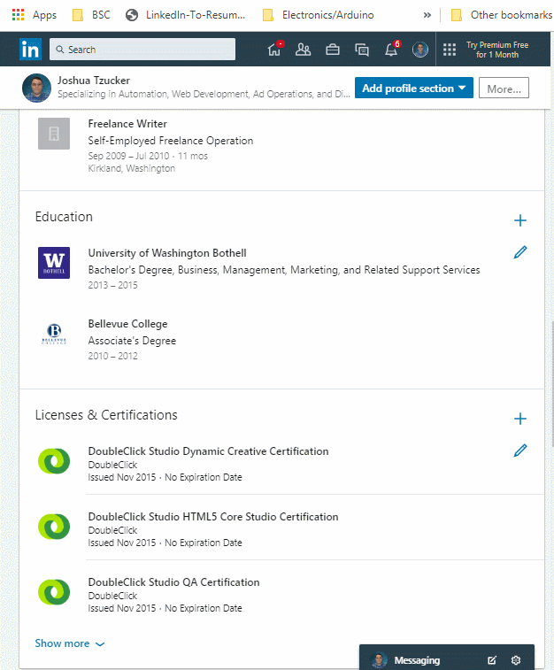

# LinkedIn Profile to JSON Resume Bookmarklet

## Breaking issue - see [this](https://github.com/joshuatz/linkedin-to-jsonresume-bookmarklet/issues/1) for details.

# Updates:
### 7/22/2019:
> ***ALERT***: This bookmarklet is currently broken, thanks to LinkedIn adding a new restrictive CSP (Content Security Policy) header to the site. [I've opened an issue](https://github.com/joshuatz/linkedin-to-jsonresume-bookmarklet/issues/1) to discuss this, and both short-term (requires using the console) and long-term (browser extension) solutions.

### 6/21/2019:
> I saw the bookmarklet was broken depending on how you came to the profile page, so I refactored a bunch of code and found a much better way to pull the data. Should be much more reliable!

# Installation:
You can either build it yourself, or grab the bookmarklet off my project page, [here](https://joshuatz.com/projects/web-stuff/linkedin-profile-to-json-resume-exporter-bookmarklet).

Note that because of LinkedIn's CORs/injection policies, I can't make an auto-updated version of this bookmarklet. If something breaks, you will have to come back here to grab an updated version (if I release it).

## What is JSON Resume?
"JSON Resume" is an open-source standard / schema, currently gaining in adoption, that standardizes the content of a resume into a shared underlying structure that others can use in automated resume formatters, parsers, etc. Read more about it [here](https://jsonresume.org/), or on [GitHub](https://github.com/jsonresume).

## What is this bookmarklet?
I made this because I wanted a way to quickly generate a JSON Resume export from my LinkedIn profile, and got frustrated with how locked down the LinkedIn APIs are and how slow it is to request your data export (up to 72 hours). "Install" the bookmarklet to your browser, then click to run it while looking at a LinkedIn profile (preferably your own), and my code will grab the various pieces of information off the page and then show a popup with the full JSON resume export that you can copy and paste to wherever you would like.

# Development
Currently, the build process looks like this:
 - `src/main.js` -> (`webpack + babel`) -> `build/main.js` -> [`mrcoles/bookmarklet`](https://github.com/mrcoles/bookmarklet) -> `build/bookmarklet_export.js` -> `build/install-page.html`
     - The bookmark can then be dragged to your bookmarks from the final `build/install-page.html`

All of the above should happen automatically when you do `npm run build`.

If this ever garners enough interest and needs to be updated, I will probably want to re-write it with TypeScript to make it more maintainable. 

# DISCLAIMER:
This tool is not affiliated with LinkedIn in any manner. Intended use is to export your own profile data, and you, as the user, are responsible for using it within the terms and services set out by LinkedIn. I am not resonsible for any misuse, or reprecussions of said misuse.